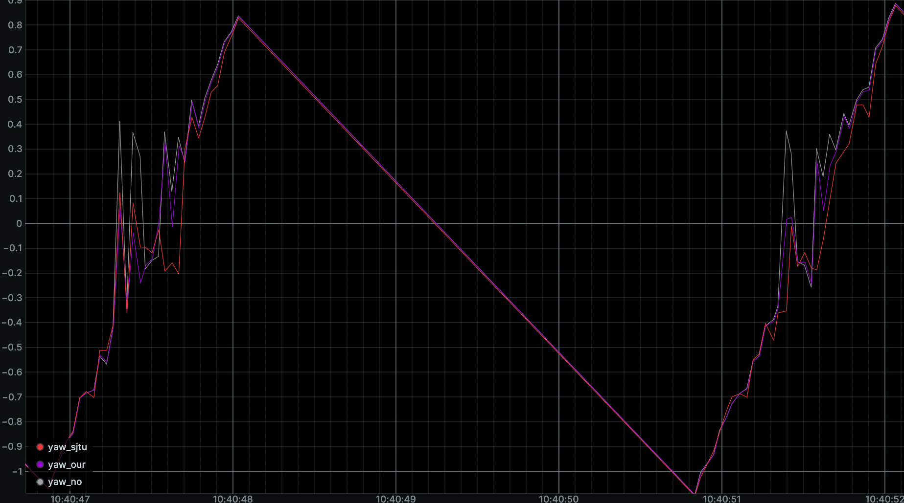
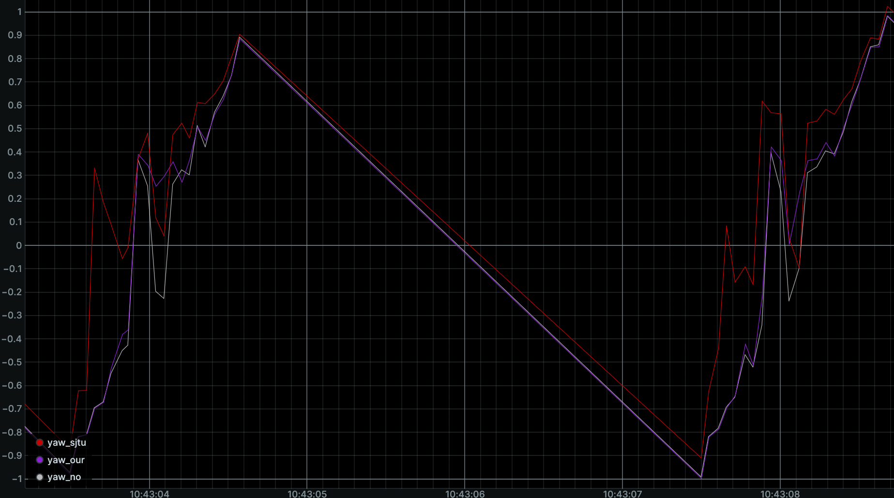

# 平面pnp优化和其协方差计算

注：或许是免责声明：我能证明的就会尽可能使用例子或者文献佐证，没给出的就是瞎猜的，要是结果不是这样的，别骂我哦！

还有一个就是：RM场景下讨论这个问题，不一定能够迁移。

关于坐标系的定义在：TODO这里

## 1. 介绍

此人是个标题党，这部分主要目的是解决几何关于直接pnp并丢给滤波器比较头疼的问题。

我们都知道，[上交23轻工会](https://sjtu-robomaster-team.github.io/antitop/)，julyfun说过，在平面四点正对时的yaw会呈现一个非常抽象的抖动，有多抽象后面结论会给图。于是乎他们给出了一个不错的解决方案。我们已经知道官方的规则，装甲板pitch无非就是15°（车上）-15°（前哨），以及roll一定是0。这样我们就可以考虑固定imu系下的装甲板的pitch和roll，设yaw为变量，计算重投影误差，采用三分法来优化yaw（在我看来，也可以尝试去使用LM法来实现）。这样我们可以得到一个不错的yaw。但是，我们都知道，装甲板pitch和roll怎么可能乖乖不动，车会加减速，会振动（不考虑上坡情况）这种情况下，我们的yaw会有严重的失真（这是当然的），因此，这种方法具有局限性。

第二点在于，实际装甲板滤波跟踪中，我们会采取“展开法”，即展开车的四个装甲板位置，并去除位于背后的，将观测得到的装甲板与虚拟“装甲板”进行匹配，以确定当前实际观测到的到底是谁。然而，我们知道，当装甲板yaw角度较大时，此时yaw的协方差是比较大的（此时神经网络可能会优于传统）。特别转速高（两帧之间偏差大），装甲板靠近且角度大（前哨站，这个是经验，我也不知道为什么）装甲板及可能因为yaw而误匹配到与其旋转90度的装甲板上。

## 2. 方法

### 1. IMU坐标转相机坐标

定义以下坐标系和变换关系：

* IMU坐标系到云台（已知）： $\mathrm{ {}^{I}_{G}T }$

* 云台到相机（已知）：$\mathrm{ {}^{G}_{C}T = {}^{G}_{C'}T {}^{C'}_{C}T }$，由于G系到C系存在一个旋转，又为了方便调试相对于云台调参，因此设置一个与C系平移一致但是旋转不同的C'系，这里可以理解为存在一个云台到相机坐标系就行。

* 相机到装甲板：$\mathrm{ {}^{C}_{A}T }$

我们可以简单计算出：

$$
{}^{I}_{A}T = {}^{I}_{G}T {}^{G}_{C}T {}^{C}_{A}T
$$

然后通过移项和求逆（当然不需要实际去求，根据旋转正交性），可以得到$\mathrm{ {}^{C}_{A}T }$

这里需要记住我们可以目的是去优化得到$\mathrm{ {}^{I}_{A}T }$

### 2. 重投影和重投影误差计算

首先计算经过畸变修正后的四点坐标，此操作可由opencv的undistortPoints方便得到。这些点是重投影后应该处于的实际位置$\mathrm{ \hat P_i }$。注意，有hat的是观测值

根据1.的内容，可以利用内参方便计算重投影：

$$
P_i = {}^{UV}P_i = K({}^{C}_{A}R {}^{A}P_i + {}^{C}_{A}t) / z
$$

注意：z是括号式计算得到坐标的z轴坐标值，计算得到的左侧结果是齐次坐标系，需要进行转换。i = 0,1,2,3。

关于重投影误差，其cost可以如下计算：

$$
Reprojection \ Cost = rc = \sum_{i=0}^{3}{||P_i-\hat P_i||^2}
$$

### 3. pitch和roll软约束

紧接着，为了解决固定$\mathrm{ {}^{I}_{A}R }$中pitch和roll导致在实际运行时产生异常的情况，此处放弃直接固定pitch和roll，而是将其作为优化目标，并采用如下cost作为优化目标。

$$
Cost = c = rc + w_{r}^2(\theta_r - 0°)^2 + w_{p}^2(\theta_p - 15°)^2 
$$

增加的惩罚项相比于三自由度全优化，可以将pitch和roll更好的拉向理论值。可以看到，在rc代价大时（优化器将会更加关注rc的代价而调整pitch和roll，试图取得rc代价的进一步降低），而在rc代价较小（优化器会更倾向于尝试将pitch和roll向理论值逼近）。权重的平方只是为了后续计算残差方便。

### 4. 非线性最小二乘的问题描述

我们要解决的是如下的非线性最小二乘问题

$$
{}^{I}_{A}T^* = x^* = [x,y,z,\theta_r, \theta_p, \theta_y]^T = argmin(\frac{1}{2}c)
$$

首先我们列写10维的残差

$$
Residual = r(x^*) = 
\begin{bmatrix} 
\hat u_{0} - u_{0} \\
\hat v_{0} - v_{0} \\
\hat u_{1} - u_{1} \\
\hat v_{1} - v_{1} \\
\hat u_{2} - u_{2} \\
\hat v_{2} - v_{2} \\
\hat u_{3} - u_{3} \\
\hat v_{3} - v_{3} \\
w_r ( \theta_r - 0° ) \\
w_p ( \theta_p - 15° )
\end{bmatrix}
$$

我们将上述坐标变换过程列写为平移旋转的形式

$$
{}^{C}_{A}R = {}^{C}_{G}R {}^{G}_{I}R {}^{I}_{A}R
$$

$$
{}^{C}_{A}t = {}^{C}_{I}R {}^{I}_{A}t - {}^{C}_{G}R {}^{G}_{C}t 
$$

带入装甲板坐标点，我们可以得到

$$
{}^{C}P = {}^{C}_{I}R {}^{I}_{A}R {}^{A}P + {}^{C}_{I}R {}^{I}_{A}t - {}^{C}_{G}R {}^{G}_{C}t 
$$

然后我们可以重投影

$$
{}^{UV}P = K {}^{C}P / z
$$

其中：$\mathrm{ {}^{I}_{A}R }$与$\mathrm{ {}^{I}_{A}t }$涵盖我们要优化的信息$\mathrm{ [x,y,z,\theta_r, \theta_p, \theta_y]^T }$

我们首先对前8行求导，对于前8行的任意一组

$$
J_i (\in \mathbb{R}^{2\times6}) = \frac{\partial (u_i, v_i)}{\partial {}^{C}P }\frac{\partial {}^{C}P}{\partial x^* }
$$

对于第一部分，我们知道内参矩阵：

$$
K = 
\begin{bmatrix}
f_x &   0 & c_x \\
0   & f_y & c_y \\
0 & 0 & 1
\end{bmatrix}
$$

因此有

$$
\frac{\partial u_i}{\partial {}^{C}P } = 
\begin{bmatrix} 
\frac{f_x}{z_c} & 0 &
-\frac{x_cf_x}{z_c^2} 
\end{bmatrix}
$$

$$
\frac{\partial v_i}{\partial {}^{C}P } = 
\begin{bmatrix} 
0 & \frac{f_y}{z_c} &
-\frac{y_cf_y}{z_c^2} 
\end{bmatrix}
$$

$$
J_c = 
\begin{bmatrix}
\frac{f_x}{z_c} & 0 &
-\frac{x_cf_x}{z_c^2} \\
0 & \frac{f_y}{z_c} &
-\frac{y_cf_y}{z_c^2} 
\end{bmatrix}
$$

对于第二部分，我们容易对平移求偏导

$$
\frac{\partial {}^{C}P}{\partial t^* } = {}^{C}_{I}R
$$

对于旋转部分，有

$$
\frac{\partial {}^{C}P}{\partial r^* } = {}^{C}_{I}R \frac{\partial {}^{I}_{A}R}{\partial r^* } {}^{A}P
$$

所以我们只需要求取$\mathrm{ \frac{\partial {}^{I}_{A}R}{\partial r^* } }$，该式是一个标准的旋转矩阵对欧拉角求雅可比，不会可以AI一下，本质上就是三角函数求导。这里直接给出结论

$$
{}^{I}_{A}R = R_zR_yR_x
$$

$$
\frac{\partial {}^{I}_{A}R}{\partial \theta_y} = \left( \frac{\partial R_z}{\partial \theta_y} \right) \cdot R_y \cdot R_x
$$

$$
\frac{\partial {}^{I}_{A}R}{\partial \theta_p} = R_z \cdot \left( \frac{\partial R_y}{\partial \theta_p} \right) \cdot R_x
$$

$$
\frac{\partial {}^{I}_{A}R}{\partial \theta_r} = R_z \cdot R_y \cdot \left( \frac{\partial R_x}{\partial \theta_r} \right)
$$

$$
\frac{\partial R_z}{\partial \theta_y} = 
\begin{bmatrix}
-\sin(yaw) & -\cos(yaw) & 0 \\
\cos(yaw) & -\sin(yaw) & 0 \\
0 & 0 & 0
\end{bmatrix}
$$

$$
\frac{\partial R_y}{\partial \theta_p} = 
\begin{bmatrix}
-\sin(pitch) & 0 & \cos(pitch) \\
0 & 0 & 0 \\
-\cos(pitch) & 0 & -\sin(pitch)
\end{bmatrix}
$$

$$
\frac{\partial R_x}{\partial \theta_r} = 
\begin{bmatrix}
0 & 0 & 0 \\
0 & -\sin(roll) & -\cos(roll) \\
0 & \cos(roll) & -\sin(roll)
\end{bmatrix}
$$

所以第二部分雅克比如下

$$
J_p = 
\begin{bmatrix}
{}^{C}_{I}R & 
\frac{\partial {}^{C}P}{\partial \theta_r } &
\frac{\partial {}^{C}P}{\partial \theta_p } &
\frac{\partial {}^{C}P}{\partial \theta_y }
\end{bmatrix} \in \mathbb{R}^{3\times6}
$$

所以有：

$$
J_i = J_c J_p
$$

对于最后两行软约束，可以很简单得到导数

$$
J_s = 
\begin{bmatrix}
0 & 0 & 0 & w_r & 0 & 0 \\
0 & 0 & 0 & 0 & w_p & 0
\end{bmatrix}
$$

于是大雅可比长这样

$$
J (\in \mathbb{R}^{10\times6}) = -
\begin{bmatrix}
J_0 \\ J_1 \\ J_2 \\ J_3 \\ J_s
\end{bmatrix}
$$

### 5. LM算法求解

## 3. 实验

### 基本信息：

* ubuntu 24.04

* godot搭建仿真环境

* 使用相同的神经网络四点模型进行测试

* sjtu方案采用ceres-solver实现。

* 我们的方案采用手写LM法实现

* 纯pnp方案采取opencv-ippe算法实现，且所有优化均以此为初值

* 下可视化图由rerun绘制

可以看到（上图），在正常 pitch 15°， roll 0° 下，我们和上交的方案均能显著降低yaw在0处的漂移且无显著差异。

可以看到（上图），在pitch为0° roll为10° 偏差时，我们的优化器能够更加准确地符合实际的角度均值，且在脱离0区后，更好地跟随实际角度。

时间方面：我使用联想小新pro14 - intel U5 - 32内存 测试，单一装甲板约为1-1.5ms。
