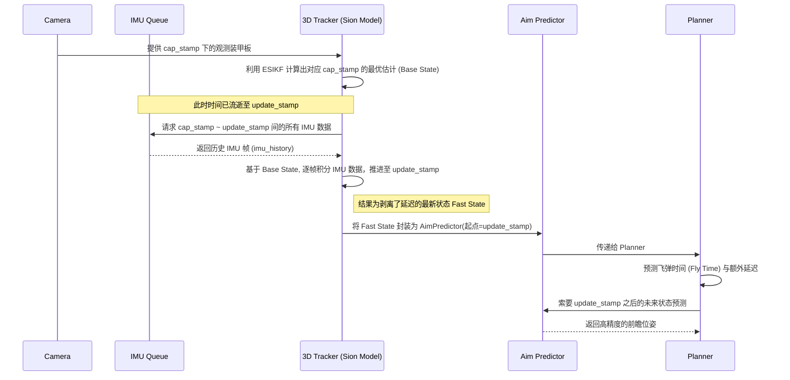

# 系统时间线与延迟补偿说明 (Time Line & Delay Compensation)

在视觉自瞄系统中，从图像捕捉、特征识别、状态估计到最终的弹道解算与云台控制，整个链路存在不可忽视的时间延迟。为了保证射击的精确性，必须在各个节点准确地进行时间戳对齐与延迟补偿。

## 1. 整体数据流与时间戳传递

根据系统设计，传感器数据（视觉与 IMU）在流转过程中的核心时间线如下图所示：

```mermaid
graph TD
    subgraph 视觉链路 (Visual Pipeline)
        A(相机曝光 Capture) -->|生成 Cap Stamp| B(图像传至 PC)
        B --> C(2D 装甲板检测 Armor 2D)
    end

    subgraph 惯性链路 (IMU Pipeline)
        D(MCU 实时位姿 Realtime Pose) --> E(WHX EKF)
        E -->|通过串口/ACM| F(传至 PC)
        F -->|分配缓冲时间戳| G(IMU 队列)
    end

    C -.通过 Cap Stamp 匹配.-> H(2D Tracker)
    G -.插值与偏移校准.-> H
    H -->|关联视觉与位姿| I(3D 装甲板 Armor 3D)
    I --> J(3D Tracker)
    J -->|结合全量历史 IMU 计算 Fast State| K(Aim Traj 包含 Predictor)
    K --> L(Mashiro Planner)
    L -->|弹道解算与额外预测| M(最终云台控制指令)
```

## 2. 核心时间概念解析

* **`cap_stamp` (Capture Stamp)**: 取自相机曝光的一瞬间。这是整个视觉特征的绝对原点所有的 2D 和 3D 观测数据，在物理意义上都严密对应于该时刻的目标状态。在底层 ESIKF 更新时，观测方程也是相对于该时间发生。
* **`update_stamp` (Update Stamp/Now)**: 当目标进入 3D Tracker 完成慢速滤波更新后，系统即将打包预测器发送给 Planner 的真实物理系统时间（即“当前时刻”）。

## 3. 高频“状态前推”与延迟剥离 (State Forwarding)

在进入 Planner 前，视觉流水线处理往往已经消耗了数毫秒至数十毫秒的时间（即 `update_stamp - cap_stamp` 的数值）。如果在Planner中直接使用带延迟的状态进行常速盲推，会导致极大的轨迹偏差。

为此，我们在 **3D Tracker** 端引入了**全量 IMU 积分**架构：



## 4. 弹道解算期的预测 (Planner Prediction)

当包含有 `Fast State` 的预测器到达 `NeMashiroPlanner` 后，规划器只负责对其进行**未来**时间的预测。
预测的总未来时间包含：
$$ t_{predict} = t_{additional\_delay} + t_{flytime} $$

其中：
* **$t_{additional\_delay}$**: 从命令下发、控制响应到机构执行的机械延时和总线通讯延时。
* **$t_{flytime}$**: 弹丸飞行时间。此参数与预测出的目标距离是一个典型的鸡生蛋/蛋生鸡关系，系统采用了**定点迭代 (Fixed-point Iteration)**在 $O(1)$ 空间微秒级时间内逼近求解。

因为进入 Planner 时使用的基础状态是以 `update_stamp` （当前时刻）为起点的，并且已经利用高频真实 IMU 补齐了黑盒延时，最终 Planner 的输出指令可以实现严格的零相位差动态对齐，最大化击中概率。
